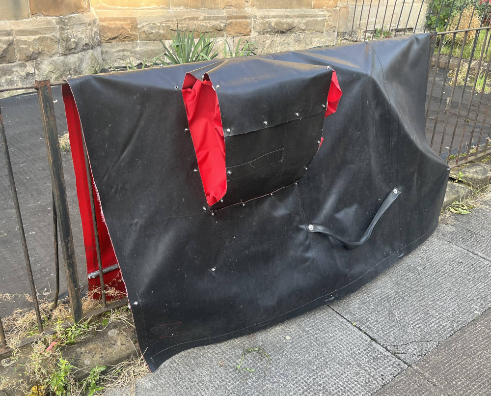
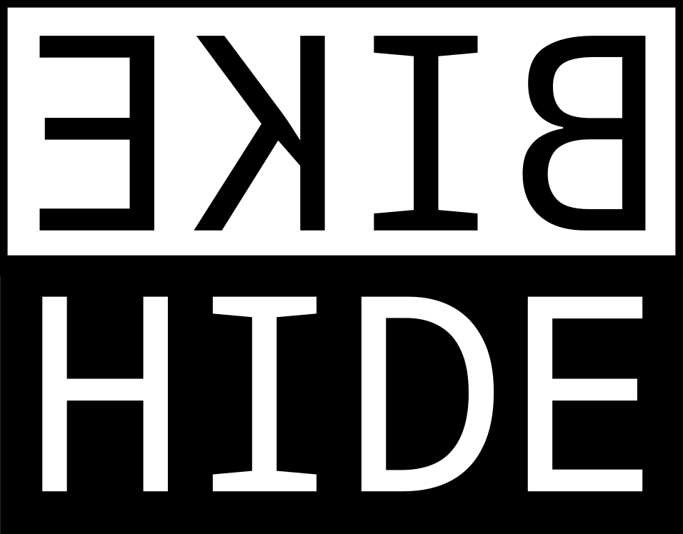

# BIKEHIDE

A [Freitag](https://www.freitag.ch) bag for your bike? A [Bikehanger](https://cyclehoop.com/product-category/bikehangars/) without the hanger? Or just a [bicycle cover](https://www.amazon.com/s?k=bicycle+cover) that doesn't become a soggy windbeaten faff once you take it off on a winter's morning?

A BIKEHIDE is recycled truck tarpaulin bicycle cover that mounts on a fence and stays there while you go riding. It makes getting on your bike quicker and drier.

No faff, no planning permission, no wet bum.

## No faff

<iframe width="640" height="360" src="https://www.youtube.com/embed/23lsDLwW4ag?rel=0" title="YouTube video player" frameborder="0" allow="accelerometer; autoplay; clipboard-write; encrypted-media; gyroscope; picture-in-picture; web-share" allowfullscreen="allowfullscreen"></iframe>

 

<iframe width="640" height="360" src="https://www.youtube.com/embed/0x8hBxCfehc?rel=0" title="YouTube video player" frameborder="0" allow="accelerometer; autoplay; clipboard-write; encrypted-media; gyroscope; picture-in-picture; web-share" allowfullscreen></iframe>

## No planning permission 

<iframe width="640" height="360" src="https://www.youtube.com/embed/fFwiU9t_jMs?rel=0" title="YouTube video player" frameborder="0" allow="accelerometer; autoplay; clipboard-write; encrypted-media; gyrosckdstaging/ope; picture-in-picture; web-share" allowfullscreen="allowfullscreen"></iframe>

## No wet bum 

<iframe width="640" height="360" src="https://www.youtube.com/embed/tQpXgP1NpUM?rel=0" title="YouTube video player" frameborder="0" allow="accelerometer; autoplay; clipboard-write; encrypted-media; gyroscope; picture-in-picture; web-share" allowfullscreen="allowfullscreen"></iframe>

## Enquiries-
Please email bikehide /at/ proton.me

<!-- UK registered design number 6316324 -->